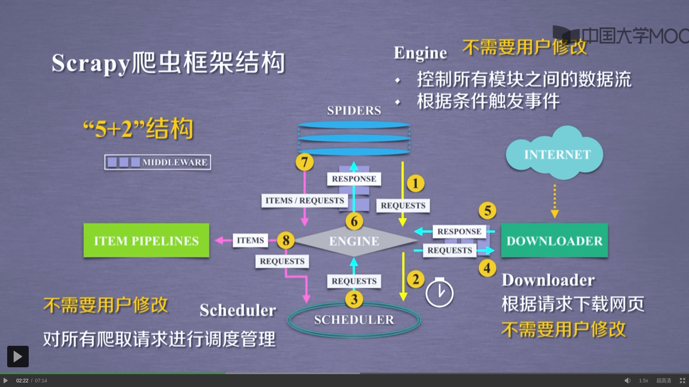
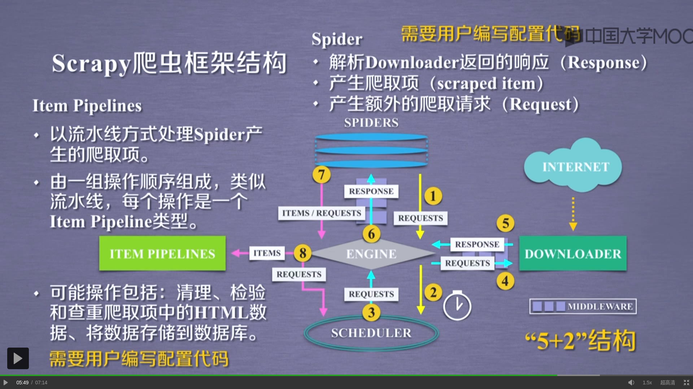

#Downloader Middleware


实施Engeine、Scheduler和Downloader之间进行用户可配置的控制




#Spider


- 解析Downloader返回的响应(Response)
- 产生爬取项(scraped item)
- 产生额外的爬取请求(Reques)

**需要用户编写配置代码**

-------------

#Item Piplines


- 以留下方式处理Spider产生的爬取项。
- 由一组操作孙旭组成类似流水线，每个操作是一个Item Pipeline类型。
- 可能操作包括：清理、检验和查重爬取项中的HTML数据、将数据储存到数据库。

**需要用户编写配置代码**

------------

#Spider Middleware


**目的**：对请求和爬取项的在处理

**功能**：修改、丢弃、新增请求或爬取项

**用户可以编写配置代码**

---------

#scrapy<command>[options][args]

##常用命令（command）
| 命令 | 说明 | 格式 |
| ---- | ---- | ----|
| startproject | 创建一个新工程 | scrapy startproject<name>[dir]|
| genspider | 创建一个爬虫 | scrapy genspider[options]<name><domain>|
| settings | 获得爬虫配置信息 | scrapy settings[optinons]|
| crawl | 运行一个爬虫 |  scrapy crawl<spider>|
| list | 列出工程中所有爬虫 | scrapy list|
| shell | 启动URL调试命令行 | scrapy shell[ulr]|

------

#Scrapy爬虫使用步骤

##步骤1：建立一个Scrapy爬虫工程

scrapy startproject<name>[dir]

###生成的工程目录

    python123demo/              外层目录
        scrapy.cfg              部署Scrapy爬虫的配置文件
        python123demo/          scrapy框架的用户自定义python代码
            __init__.py         初始化脚本
            items.py            Items代码模板（继承类）
            middlewares.py      Middlewares代码模板（继承类）
            pipelines.py        Pipelines代码模板（继承类）
            setting.py          Scrapy爬虫的配置文件
            spiders/            Spiders代码模板目录（继承类）
                __init__.py     初始文件，无需修改
                __pycache__/    缓存目录，无需修改

------

##步骤2：在工程中产生一个Scrapy爬虫模板

scrapy genspider[options]<name><domain>

---

##步骤3：编写spider爬虫

    spiders/
        spider.py       爬虫
            parse()     用于处理相应，解析内容内容形成字典，发现新的URL爬取请求
            
###Scrapy爬虫的数据类型

####Request类

class scrapy.http.Request()

- Request对象表示一个HTTP请求。
- 由Spider生成，由Downloader执行。 

| 属性或方法| 说明|
| ----| ----|
| .url| Request对应的请求URL地址|
| .method| 对应的请求方法，‘GET’‘POST’等|
| .headers| 字典类型风格的请求头|
| .body| 请求内容主题，字符串类型|
| .meta| 用户添加的扩展信息，在Scrapy内部模块间传递信息使用|
| .copy()| 复制该请求|

####Response类

class scrapy.http.Response()

- Response对象表示一个HTTP响应。
- 由Downloader生成，由Spider处理

| 属性或方法| 说明|
| ----| ----|
| .url| Response对应的URL地址|
| .status| HTTP状态码，默认是200|
| .headers| Response对应的头部信息|
| .body| Response对应的内容信息，字符串类型|
| .flags| 一组标记|
| .request| 产生Response类型对应的Request对象|
| .copy| 复制该响应|

####Item类

class scrapy.item.item()

- Item对象表示一个从HTML页面中提取的信息内容。
- 由Spider生成，由Item Pipeline处理。
- Item类似字典类型，可以安装字典类型操作。


##Scrapy爬虫提取信息的方法

Scrapy爬虫支持多种HTML信息提取方法

- Beautiful Soup
- lxml
- re
- Xpath Selector
- CSS Selector

###CSS Selector的基本使用

\<html>.css('a::attr(href)').extract()

````
a       标签名称
href    标签属性
````

CSS Selector 由W3C组织维护并规范

---

##步骤4：编写Item Pipeline

---

##步骤5：优化配置策略

###配置并发连接选项

settings.py文件

| 选项| 说明| 
| ----| ----| 
| CONCURRENT_REQUESTS| Downloader最大并发请求下载数量，默认32| 
| CONCURRENT_ITEMS| Item Pipeline最大并发ITEM处理数量，默认100| 
| CONCURRENT_REQUESTS_PER_DOMAIN| 每个目标域名最大的并发请求数量，默认8| 
| CONCURRENT_REQUESTS_PER_IP| 每个目标IP最大的并发请求数量，默认0，非0有效| 

------


